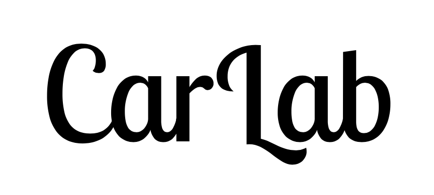
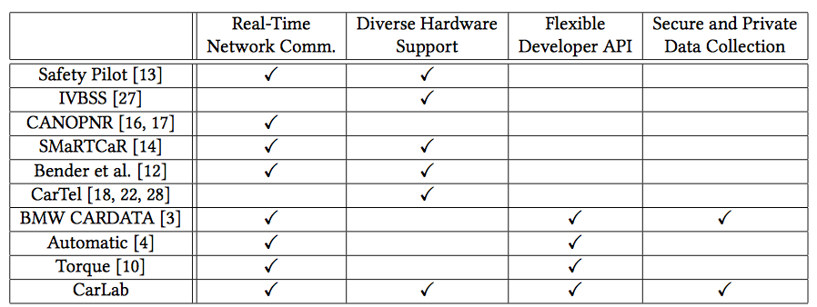

# News
[10/20/17] Our [CarLab paper](http://web.eecs.umich.edu/~mpese/papers/ACM_CarSys_CarLab.pdf) was presented at ACM CarSys 2017.  
[10/15/17] CarLab is released for testing for lab members at University of Michigan.  
[08/23/17] Our CarLab paper got accepted at ACM CarSys 2017.

# Description
CarLab is an open-source vehicular data collection and processing platform. Besides optimized data collection from vehicular and mobile sensors, We are aiming at offering end consumers, researchers and app developers an open, secure and privacy-preserving platform for automotive apps.

#### Prior Work on Data Collection
Vehicular data collection has been an active area in academic and commercial domains. In academic domains, data collection testbeds such as [SafetyPilot](https://www.nhtsa.gov/sites/nhtsa.dot.gov/files/812171-safetypilotmodeldeploydeltestcondrtmrep.pdf), [DOME](https://dl.acm.org/citation.cfm?id=1651431) and [CarTel](http://cartel.csail.mit.edu/doku.php) design a data collection platform and deploy them in volunteer vehicles. They collect data pertaining to their research question and analyze the results. However, due to the different requirements of each project, they are forced to develop a custom data collection platform without leveraging the work done by others. CarLab aims to serve this need by providing a flexible data collection platform that can be utilized for diverse needs.

In commercial domains, data collection has been used in insurance telematics (e.g.[Progressive Snapshot](https://www.progressive.com/auto/discounts/snapshot/)), car enthusiast mobile data collection apps (e.g. [Automatic](https://www.automatic.com), [Torque Pro](https://play.google.com/store/apps/details?id=org.prowl.torque&hl=en)) and vehicular data collection platforms installed by the OEM (e.g. [BMW's CARDATA](https://www.bmw.com/en/topics/fascination-bmw/connected-drive/bmw-cardata.html)). These commercial solutions have limitations, however the main downside is the lack of open source code. Providing the source code of a data collection platform is important in encouraging the growth of vehicular applications and clearly showing the consumers what data is being collected.

#### Distinguishing Features of CarLab
In contrast to the existing work described above, CarLab seeks to address the diverse needs of data collection platforms and act as a unifying force in this field.

We provide four key features through CarLab.
1. **Real-time network communication**. CarLab presents a API to data collection applications for uploading and downloading content from the Internet. The most challenging part about providing this functionality is balancing (1) the user's budget for local storage and network usage, (2) the app requirements of network communication size and deadline, and (3) the network availability of WiFi and LTE networks. CarLab handles this balancing in the background and provides a simple API for applications residing on the CarLab platform.

2. **Diverse hardware support**. In order to serve as a unifying platform, CarLab supports many data sources, as shown in the figure in the top of this page. CarLab is designed to accept various data sources flexibly through the Hardware Abstraction Layer (HAL). Each application running on CarLab interfaces with the HAL and requests the data source. CarLab performs necessary setup and initiates a connection with the data source. It then feeds the data back to the requesting application through a callback interface.

3. **Flexible developer API**. In order to develop applications that utilize the CarLab platform, we provide a simple developer API. Furthermore, the goal of our developer API is to provide cross-platform support across multiple operating systems. Specifically, a researcher or developer can write an app for CarLab and run the same app on both Android and iOS implementations of CarLab.

4. **Secure and Private Data Collection**. Finally, CarLab is careful not to leak any private or sensitive information from the users to the applications running on CarLab. In order to achieve this, we provide a permission model for applications running on CarLab. The user must review the permissions and decide whether to install the application. Furthermore, as recent works have shown (e.g. [PowerSpy](https://www.usenix.org/system/files/conference/usenixsecurity15/sec15-paper-michalevsky.pdf)), under-privileged apps can learn sensitive information about the user such as their location. We plan to study this research question through CarLab and prevent such privacy leakage.

# Source Code
We plan to release the source code for the public on our official Github repository at the MCity Tech Review on November 14th, 2017.

# Academic Publications
Mert D. Pesé, Arun Ganesan and Kang G. Shin, “CarLab: Framework for Vehicular Data Collection and Processing,” Proceedings of the Second ACM International Workshop on Smart, Autonomous, and Connected Vehicular Systems and Services (CarSys’17), Oct. 2017.

# Acknowledgements and Disclaimers
CarLab is supported in part by the NSF under Grant CNS-1505785 and an Intel Labs contract, as well as a University Michigan MCity grant. We want to thank to our main developers Mert D. Pesé and Arun Ganesan as well as Victor Boyse-Peacor’s help in CarLab development.
