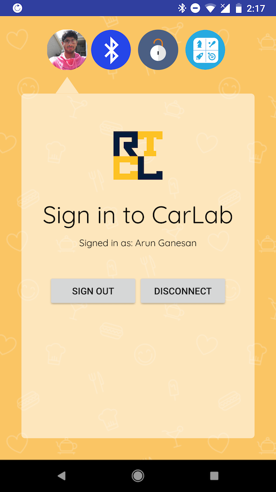
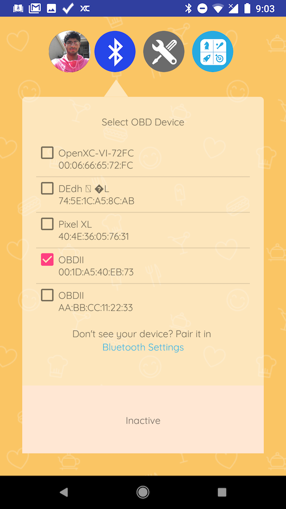
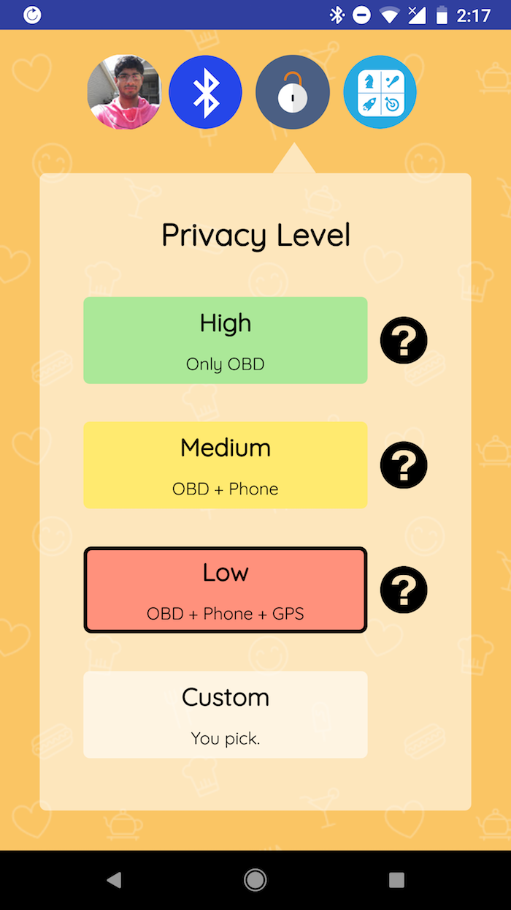
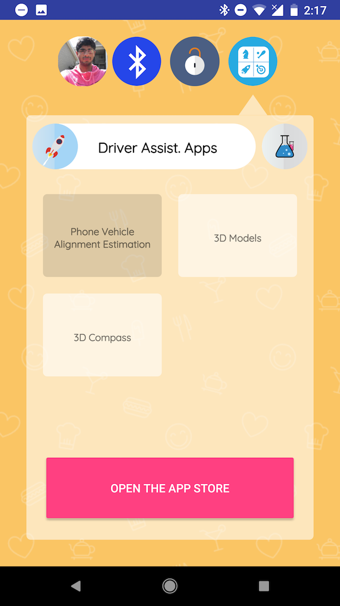

# CarLab Android App

The Android app has four main tabs - account management, connectivity, privacy settings, and plugins. A user first logs on using their Google account. The same account is used in the web interface to browse and download data. Next the user selects the OBD-II dongle in the Connectivity tab. In the Privacy tab, the user can review their privacy policies, choose which sensors they are willing to share, and learn more about the privacy risks of sharing individual sensors. In the Plugins tab, the user has two further sections which they can navigate using buttons inside the Plugins tab -- they can find and install Driver Assistance Apps (DAA) or review the Data Collection Tasks (DCT) assigned to them.

