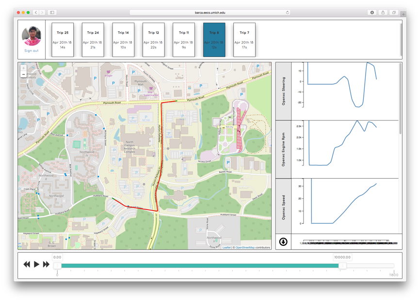

# CarLab Visualization Dashboard
A user or researcher can review their trip information using the web-based visualization dashboard.

A user first connects to the dashboard using their Google account. If you log in through the Driver view, the dashboard shows your collected trips. If you log in through the Researcher view, the dashboard shows the trips of the data collection task you've selected. The top of the dashboard lists all trips in your collection. You can left-click the trip to load it in the dashboard, or right-click to delete or download the trip. If the trip contains location traces, it will visualize in the map in the left of the screen. The right side will show the sensor values collected in this trip, restricted by the timeline in the bottom of the dashboard. You can adjust the dashboard to show more or less of the data. You can also press the play button to animate through the sensor data. You can also click on the sensors in the right side to select a subset and download them by pressing the download button.