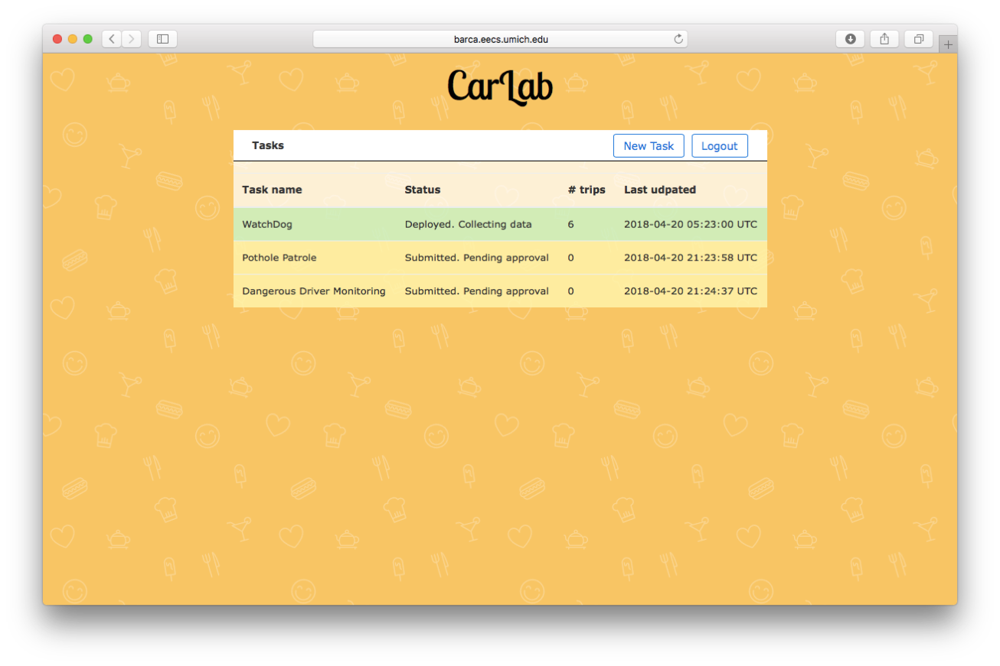
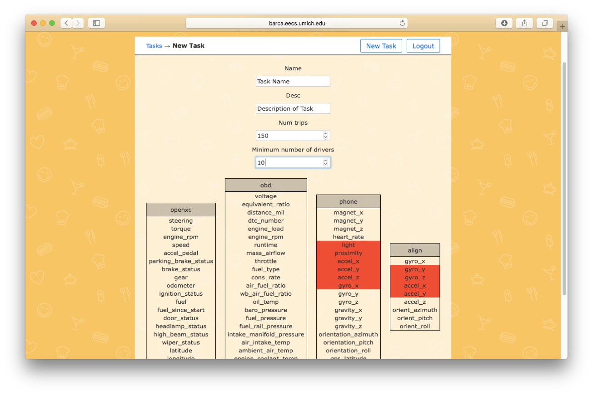
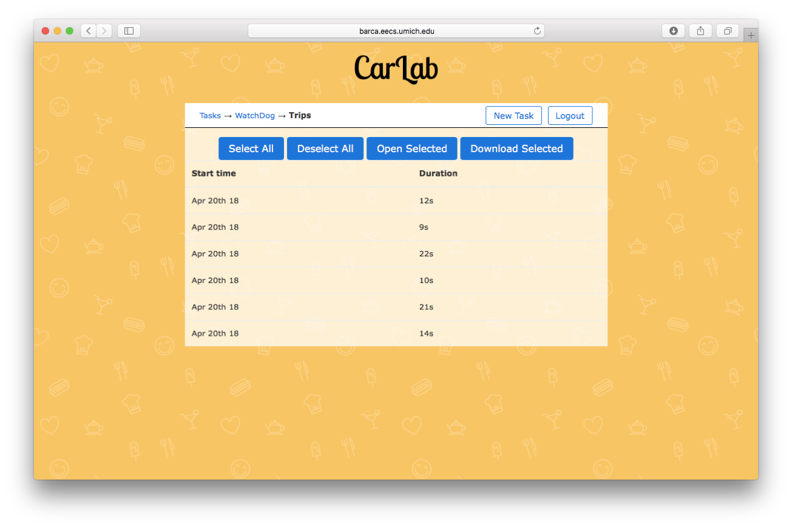

# Workflow for Data Collection Submission

In the researcher view, you can review your tasks, submit new data collection tasks, or view/download trips collected for that task. 

To submit a new task, press the "New Task" button in the top right. This will bring you to a form where you can specify the details of the task and which sensors you want to collect. 

Finally, once the data collection is complete, you can press the "Open Trips" button in the Task page and download or open the tasks in the dashboard. All selected tasks will be zipped into a folder and downloaded through your browser.

## Todo
* In the researcher view, we can show an expected time to completion for the data collection task. For example, if the task requires many sensors, then we can count how many drivers are willing to share those sensors and estimate the time required to complete the task. 