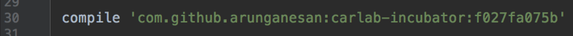
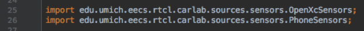
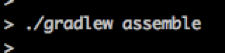
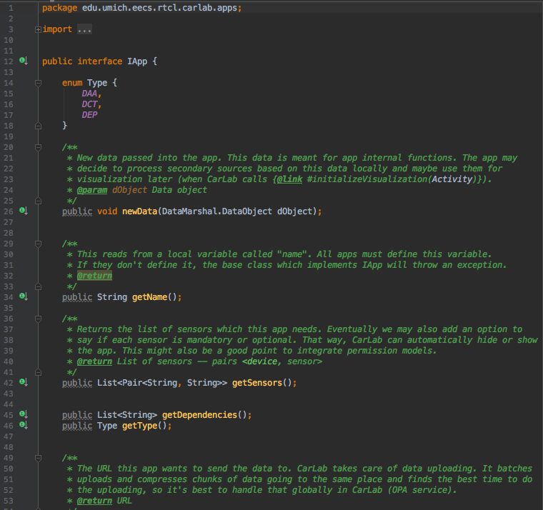

# Workflow for creating CarLab plugins.

CarLab plugins come in two flavors -- Driver Assistance Apps (DAA) and Dependencies (DEP). DAAs are user-facing applications which can define user interface elements such as a navigation map or an image with the current speed limit. DEPs are dependencies which are used in other plugins. In contrast to DAAs, DEPs can also output a value. Each DEP has to specify the list of output values statially.

Plugin development requires four main steps.
1. Add the Gradle plugin <br />
2. Extend the `App` class <br />
3. Import the relevant sensors <br />
4. Compile the class into an APK file <br />


## App Interface
The plugin has to extend the `App` class. The `App` class has certain methods which must be implemented. Both DAAs and DEPs have to specify other dependencies they rely on using the ```this.dependencies``` variable. The CarLab Service calls the activity lifecycle methods inside `App`. A plugin can override these methods to receive activity lifecycle calls. A plugin can also optionally extend `SensorStreamAppBase` to automatically visualize the sensors streams using a line chart. This is the default class for data collection tasks.



## Todo
* An automated app submission process. Once the developer compiles the APK, currently we need to manually load that into the CarLab "app store". We need a more automated process through which developers can upload APKs and create the web-based description of their plugin for deployment in the CarLab app store.

* Dependency description and uploading. When Data Collection Tasks (DCTs) or other plugins use dependencies, they need a way to browse the behavior of the DEP and decide whether or not to rely on it. Currently we don't have a way of listing the full details of the DEP. We may decide to make all dependencies open source so that other plugin developers can make an informed decision before using it in their plugin.

* Sandboxing for each plugin. In order to ensure fair usage of resources, we have to create a sandbox around each plugin. The sandbox should monitor resources such as unathorized access to sensors, network access, CPU usage, and energy consumption of each plugin.